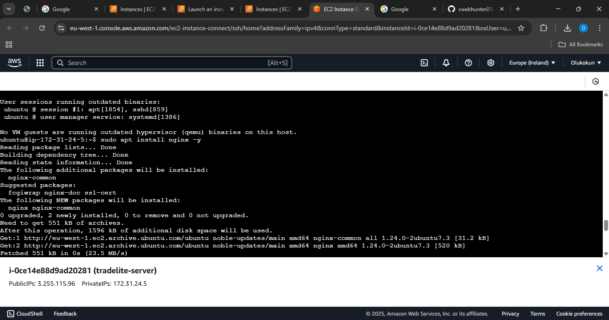
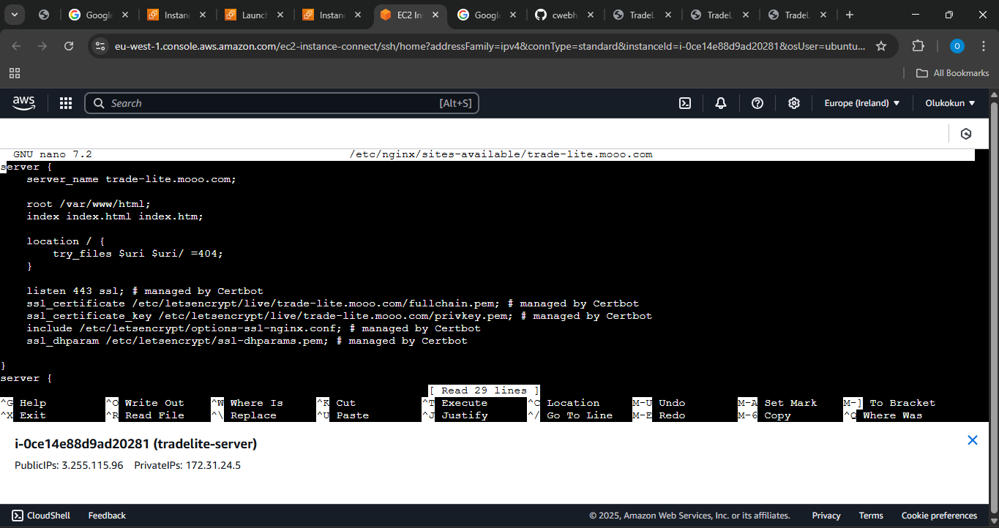
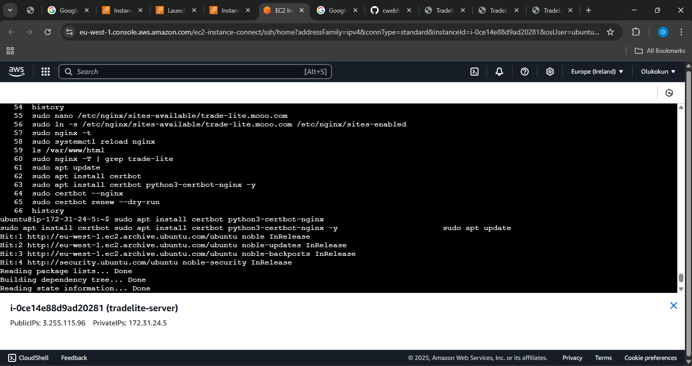

# 🌍 TradeLite – The Future of Micro-Commerce in Africa

> Empowering Africa’s smallest vendors with cloud-native infrastructure and seamless digital tools.

---

## 🧠 Project Overview

**TradeLite** is a digital infrastructure startup powering Africa’s micro-commerce economy.  
Our mission is to enable local vendors, artisans, and micro-entrepreneurs to:

- Digitize their transactions  
- Manage inventory  
- Access pooled investment  
- Scale effortlessly with cloud technology

This project is a landing page hosted on an AWS EC2 instance with full reverse proxy, (sub)domain configuration, and HTTPS encryption.

---

## 👨🏽‍💻 About Me

**Olukokun Adeyemi Favour**  
🌐 *Cloud Engineer | Systems Thinker | Visionary Builder*

> I design scalable and secure systems that power real-world impact — one micro-enterprise at a time.

---

## ✨ Key Features

- ⚙️ Hosted on AWS EC2 (Ubuntu)
- 🌐 Custom Subdomain: [`trade-lite.mooo.com`](http://trade-lite.mooo.com)
- 🚀 Reverse Proxy via Nginx
- 🔐 HTTPS Enabled via Certbot + Let's Encrypt
- 📦 Project pushed and version-controlled using Git

---

## 📸 Project Screenshots

### 🚀 GitHub Deployment

### 🖥️ Nginx Setup on EC2

.png)

### 🌐 Domain/Subdomain Configuration

### 🔁 Reverse Proxy Configuration  
  

### 🔐 HTTPS with Certbot

---

## 🧭 Deployment Roadmap

| Phase | Description |
|-------|-------------|
| ✅ Phase 1 | Build & Style Landing Page |
| ✅ Phase 2 | Push to GitHub |
| ✅ Phase 3 | Clone to EC2 |
| ✅ Phase 4 | Configure Reverse Proxy |
| ✅ Phase 5 | Link Subdomain |
| ✅ Phase 6 | Enable HTTPS |

---

## 🔗 Useful Links

- [🌐 Live Project Site](http://trade-lite.mooo.com)
- [📡 IP Address Hosted](http://3.255.115.96/)
- [💻 GitHub Repository](#)
- [📧 Email](mailto:favourolukokun@gmail.com)

---

## 🙏 Acknowledgements

Built with ❤️, patience, and persistence.  
Gratitude to the AltSchool Engineering curriculum and all the mentors who made this journey possible.

---

> © 2025 TradeLite — Olukokun Adeyemi Favour
